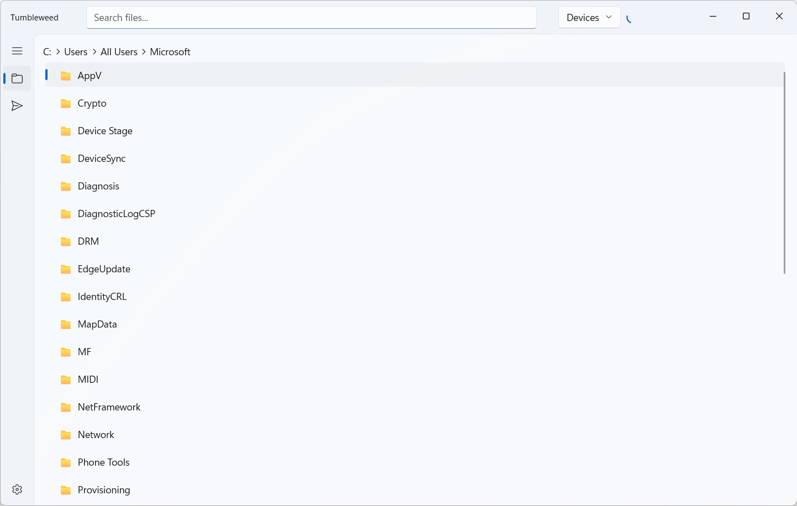

# Tumbleweed

A LAN file-transfer app for Windows, built in **Rust + WinUI 3** with the
[`windows-reactor`](https://github.com/microsoft/windows-rs) widget library.

Each Tumbleweed instance is both an **HTTP file server** and an **mDNS
advertiser**, so machines on the same network can discover each other and push
files to one another — no cloud, no accounts, no configuration.



## Features

- **File explorer** — browse folders with a breadcrumb bar and a list view.
  Remembers the last folder you opened (defaults to your Downloads folder on
  first launch).
- **mDNS advertising** — advertises this machine as
  `tumbleweed-<hostname>.local` with the service type `_tumbleweed._tcp.local`,
  so other Tumbleweed instances (and clients) can find it by name.
- **HTTP file server** — serves the currently-explored folder over HTTP
  (`GET` / `HEAD`), and accepts incoming files via `PUT`.
- **Incoming upload confirmation** — before a received file is written, a
  dialog asks you to confirm and pick the destination folder.
- **Device discovery** — finds other Tumbleweed devices on the LAN every 3
  seconds; the title-bar footer shows them in a dropdown with a live count
  badge (an indeterminate ring while it is still searching). Your own
  advertisement is filtered out.
- **Send to device** — pick a device in the footer, then click the upload
  button on any file in the explorer to push it over the LAN. Success/failure
  is reported with a transient InfoBar.
- **Transfer history** — a Transfer page with **All / Downloads / Uploads**
  tabs tracking everything you send and receive.
- **Appearance settings** — switch the app theme (follow system / light /
  dark) from the Settings page.
- **Fuzzy search** — type in the title-bar search box to fuzzy-match files in
  the current folder; choosing a result selects it in the explorer list.

## How it works

```
┌───────────────┐   mDNS  _tumbleweed._tcp.local   ┌───────────────┐
│  Tumbleweed A │ ◄──────────────────────────────► │  Tumbleweed B │
│  (this app)   │    HTTP PUT /name  (file push)   │  (peer)       │
└───────────────┘                                  └───────────────┘
```

- On startup the app advertises a unique per-machine hostname over **mDNS**
  and starts an HTTP server on `8000`.
- Other Tumbleweed apps are discovered via mDNS PTR/A queries.
- To send a file, the app performs an `HTTP PUT` to the picked device's
  address; the peer shows a confirmation dialog and saves the file wherever
  you choose.
- Directory listing over HTTP is **off by default** (opt-in), so the server
  only serves individual files you explicitly share.

## Project structure

```
src/
├── main.rs              # App entry: shared state, title bar, navigation
├── pages/
│   ├── explore.rs       # File explorer + fuzzy search + upload button
│   ├── settings.rs      # Settings page (theme) with reusable simple_card
│   └── transfer.rs      # Transfer history (All / Downloads / Uploads)
└── tools/
    ├── client.rs        # HTTP client used to push files to peers
    ├── mdns.rs          # mDNS advertiser + device discovery
    ├── picker.rs        # WinUI folder picker (incoming uploads)
    ├── server.rs        # HTTP file server (GET / HEAD / PUT)
    └── upload_gate.rs   # Bridges upload confirmations to the UI thread
```

The pages all share a single render context (`RenderCx`); state lives in
`app` and is passed down as parameters.

## Requirements

- Windows 10/11
- Rust toolchain (stable). The project uses Windows-specific dependencies
  pulled from the `windows-rs` git branch, so it builds on Windows only.

## Build & run

```powershell
cargo build --release
cargo run
```

> **Note:** if you get a `resources.pri` lock error (`os error 1224`) while
> rebuilding, a previous instance is still running. Stop it first:
>
> ```powershell
> Get-Process tumbleweed -ErrorAction SilentlyContinue | Stop-Process -Force
> ```

The executable is framework-dependent and expects the Windows App SDK runtime
to be installed (handled by the `windows-reactor-setup` build dependency).

## Configuration

- **HTTP port:** `tools::server::HTTP_PORT` (default `8000`).
- **Directory listing:** opt-in. It is disabled by default; enable it later by
  wiring `tools::server::set_list_directories(true)` into the UI.
- **Settings persistence:** the last-opened folder is stored in
  `%LOCALAPPDATA%\tumbleweed\settings.ini`.

## Security notes

- The HTTP server is **cleartext and unauthenticated** — intended for trusted
  LANs only. Do not expose it to the public internet.
- Incoming files are only written after you confirm and pick a destination,
  so the server never writes blindly.
- The `..` path traversal is rejected on the server side.

## CI / releases

The GitHub Actions workflow (`.github/workflows/rust.yml`) builds a release
and uploads a `tumbleweed.zip` artifact to the GitHub Release whenever you
push a tag matching `v*`.

## License

See the repository's license file (if any). This project is for learning and
LAN experimentation.
